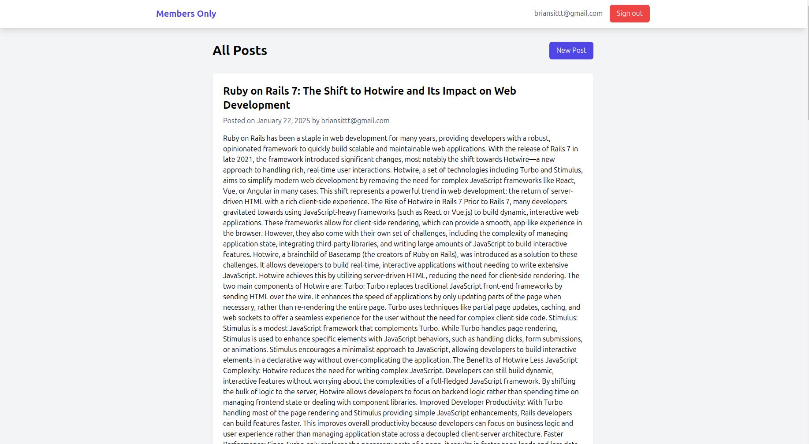

# Members Only: Exclusive Clubhouse with Authenticated Posts



## Introduction

This project is a clubhouse where members can create, view, and read anonymous posts. The challenge involves implementing user authentication to ensure that only logged-in members can see the author of each post. When logged out, members can view the posts but not see the identity of the authors. This project helps in honing skills in building authentication systems and handling user-generated content while implementing best practices with **Devise** for authentication and **Hotwire** for dynamic interactions.

---

## Project Overview

### Goal

The goal of this project is to create an exclusive clubhouse where:
1. Members can write anonymous posts.
2. Logged-in members can see who the author of a post is.
3. Logged-out users can only see the content of the posts, leaving them wondering who wrote it.


### Key Features

- **Authentication**: Users must sign up and sign in to access certain features.
- **Anonymous Posts**: Only logged-in users can see the authors of the posts.
- **Dynamic Content**: Use Hotwire to update the content dynamically without full page reloads.

---

### Create the Rails App

1. Create a new Rails app and set up a GitHub repository for it. Update your README file with relevant details.
2. Install **Devise** for authentication by adding it to your Gemfile:

    ```ruby
    gem 'devise'
    ```

3. Install **Devise** and run the installation generator:

    ```bash
    bundle install
    rails generate devise:install
    ```

4. After running the installation, you’ll need to set up Devise to handle user registration and authentication.

### Add the Responders Gem for Turbo Support

Devise will need to work smoothly with Turbo Drive (for dynamic page updates). Add the **Responders** gem to your Gemfile:

```ruby
gem 'responders'
```

Run the generator:

```bash
rails generate responders:install
```

This ensures Devise works correctly with Turbo in Rails.

### User Authentication Routes and Views

1. Set up the user model by generating it with Devise:

    ```bash
    rails generate devise User
    ```

2. Run the migrations to create the users table:

    ```bash
    rails db:migrate
    ```

---

## Authentication and Posts

### Create the Post Model and Controller

1. Generate the **Post** model and a corresponding **Posts** controller:

    ```bash
    rails generate model Post title:string body:text user:references
    rails generate controller Posts
    ```

2. Run the migrations to create the posts table:

    ```bash
    rails db:migrate
    ```

### Restrict Access in Posts Controller

In your **PostsController**, use a `before_action` filter to restrict access to the `#new` and `#create` methods. Only signed-in users should be able to create a new post.

```ruby
class PostsController < ApplicationController
  before_action :authenticate_user!, only: [:new, :create]

  # Other actions (index, new, create)
end
```

### Create a New Post Form

In the `app/views/posts/new.html.erb` file, create a form for users to write new posts:

```erb
<%= form_with model: @post, local: true do |form| %>
  <div>
    <%= form.label :title %>
    <%= form.text_field :title %>
  </div>

  <div>
    <%= form.label :body %>
    <%= form.text_area :body %>
  </div>

  <div>
    <%= form.submit 'Create Post' %>
  </div>
<% end %>
```

This will create a simple form for users to input a title and body for their post.

### Handle the Create Action

In the **PostsController**, define the `#create` action so that the `user_id` of the currently signed-in user is automatically assigned to the post.

```ruby
def create
  @post = current_user.posts.build(post_params)
  if @post.save
    redirect_to posts_path, notice: 'Post was successfully created.'
  else
    render :new
  end
end

private

def post_params
  params.require(:post).permit(:title, :body)
end
```

### Display Posts in the Index View

In your `PostsController`, implement the `#index` action to display all posts. In the `app/views/posts/index.html.erb`, list the posts and display the author's name only if a user is signed in.

```erb
<% @posts.each do |post| %>
  <div>
    <h2><%= post.title %></h2>
    <p><%= post.body %></p>
    <% if user_signed_in? %>
      <p>Author: <%= post.user.name %></p>
    <% end %>
  </div>
<% end %>
```
